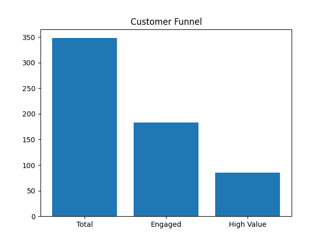
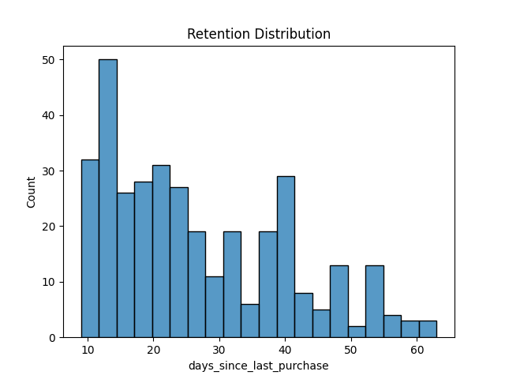

# Product Analytics Dashboard: Funnel & Retention Analysis

## Overview

Analyzed customer behavior data to identify engagement, retention, and monetization patterns. Built a structured analytics pipeline and dashboard to extract actionable product insights.

## Key Insights

1. Only ~52% users are engaged → opportunity to improve onboarding
2. ~46% of engaged users convert to high-value → monetization gap
3. ~36% churn → need for retention strategies
4. Satisfaction strongly correlates with revenue

## Product Recommendations

1. Improve onboarding to increase engagement
2. Introduce targeted upsell strategies
3. Replace blanket discounts with personalized offers
4. Launch re-engagement campaigns for inactive users

## Experiments Designed

1. Onboarding optimization → improve engagement rate
2. Personalized pricing → improve conversion
3. Re-engagement campaigns → reduce churn

## Tech Stack

1. Python (Pandas, Matplotlib, Seaborn)
2. Data Analysis & Visualization
3. Dashboard 

## Dashboard Preview

### Funnel

### Retention

## Project Structure

analysis.py      # data processing
results.py       # metrics + visualization
data.csv         # dataset

## Outcome

Demonstrated how data can be used to drive product decisions, identify user behavior patterns, and improve business metrics.
